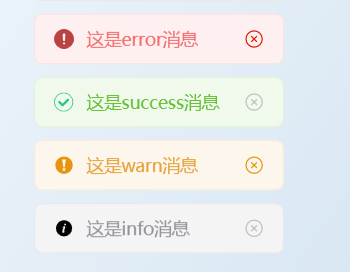
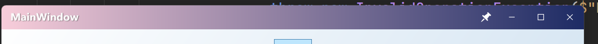

# Wpf常用库

> 使用.net8 构建的wpf常用工具库，封装了mvvm、依赖注入、消息通知、常用工具等。
>
> 作者: love-yuri

## 更新日志

### 2.0.6
1. 修复更改程序集后资源字典引用错误的问题

### 2.0.5
1. 删除多余日志
2. 解耦工具，迁移至love-yuri.NetToolkit
3. 删除多余无用依赖

### 2.0.4
1. 修复DiService退出事件类型错误的bug

### 2.0.3
1. 新增modern组件套装，将重新实现的控件，统一命名为modern-xx
2. WindowUtils 安全获取第一个可见窗口的功能
3. 所有通知功能命名为Notify-xx
4. 通知功能新增无窗口调用功能-使用WindowUtils获取的安全窗口
5. 新增ViewModel-UserControl 和 window
6. 新增枚举工具：string.Parse, string.TryParse, GetDescription
7. 修复Log.Debug不生效的bug

## 快速开始

1. 在项目中引入依赖: `<PackageReference Include="love-yuri.WpfCommon" />`
2. 直接开始使用

## 项目依赖

- `wpf`
- `Microsoft.Extensions.DependencyInjection` :  `9.0.1`
- `Microsoft.Extensions.Hosting` : `9.0.1`

## Api

### Service

> 位于项目: `Core/Service` 目录下: 位于包: `LoveYuri.Core.Service`
>
> 封装了常用的服务

#### DiService

> 依赖注入服务，这是di依赖注入的核心服务类。

1. `static void RegisterDiService(...)` 核心方法，下面所有的函数使用的前提就是调用注册服务。
    1. this Application application: 需要进行注册的application
    2. Action<IServiceCollection> register: 进行具体注册的函数回调
2. ` static T GetService<T>() where T : class` 调用GetService方法。
3. `public static T GetRequiredService<T>()` 从容器里获取服务。使用这个需要进行host的注册。

### Mvvm
> 位于项目: `Core/Mvvm` 目录下: 位于包: `LoveYuri.Core.Mvvm`
>
> 封装了mvvm常用的工具

#### BaseUserControl<TVM>

> 基础用户控件类,有一个模板参数。使用diService自动注入ViewModel。所以需要提前注册di服务.

##### 常用api

1. `TVm ViewModel => {}` 线程安全的返回ViewModel对象。

#### BaseViewModel

> 实现了INotifyPropertyChanged的基础BaseViewModel，提供常用的更新方法。

##### 常用api

1. ` protected virtual void OnPropertyChanged(...)` 线程安全的通知属性变化
2. `protected bool SetField<T>(...)` 设置属性，如果有更新则会通知界面元素更新。
3. `protected bool SetField<T>(...)` 如果元素能够更新且check通过则更新元素，否则不会更新。

#### RelayCommand

> 实现了ICommand的类，能够快速创建ICommand指令。提供有模板和无模板参数的版本。

### Notification

> 位于项目: `Core/Notification` 目录下。位于包: `LoveYuri.Core.Notification`
>
> 提供了快捷的通知方法，默认是居中顶部显示。
>
> 支持自动关闭、支持鼠标悬浮不关闭离开后自动关闭。
>
> 支持自定义关闭时间、是否自动关闭。
>
> 使用弱引用以及更改content的方法实现，所以没有资源释放的问题。

#### 显示效果



#### api

1. `ShowSuccess（this Window window, string message, bool autoClose = true, int duration = 2000）`
    - `window` 待显示的window
    - `message` 需要显示的消息
    - `autoClose` 是否要自动关闭，如果为true则会在`duration `ms后启动关闭
2. `ShowInfo` 同上
3. `ShowWarning` 同上
4. `ShowError` 同上

### Components

> 位于项目: `Components` 目录下。位于包: `LoveYuri.Components`
>
> 封装了一些常用的组件和组件样式。

#### ToolButton

> 就是一个带有动效的工具按钮，默认是蓝色。

#### **ModernWindow**

> 更漂亮，更现代化的无边框窗口。
>
> 去除原来的顶部样式且保留最大/最小化动画。
>
> 支持钉住功能。



### Utils

> 位于项目: `Utils` 目录下。位于包: `LoveYuri.Utils`
>
> 封装了一些常用工具。

#### Log

> 日志类，提供了快速格式化输出日志的方式。
>
> 主要有 info、error、debug三种类型。debug仅在开启debug时才会打印。error会打印红色字符。
>
> 示例： [2025-05-12 16:16:06.917  Info] 这是打印的格式。
>
> 提供 `FormatMsg `方法返回格式化后的字符传，支持传入自定义level

#### StringUtils

> 提供了字符串相关的方法，支持扩展方法调用

- `"22.1".ToDouble(default = 0.0 默认可不填)` 将字符串格式化成double类型，如果格式化失败则返回默认值。
- `"22".ToInt(default = 0.0 默认可不填)` 将字符串格式化成int类型，如果格式化失败则返回默认值。
- `"#ff00ff".toColor()` 将字符串格式化成Color类型，转换失败则抛出异常。

#### TimerUtils

> 提供timer相关的api，支持扩展方法调用

##### Timeout

> 延迟多少ms后执行任务。
>
> 支持使用Dispatcher，如果不传入Dispatcher则使用默认线程执行。
>
> 函数返回Timer 可自行提前停止。

```csharp
4_000.Timeout(() => {
    Log.Info($"4s后执行的info日志");
});
```

##### Interval

> 每多少ms执行一次任务，可以设置最多执行n次，如果不设置则一直执行。
>
> 支持使用Dispatcher，如果不传入Dispatcher则使用默认线程执行。
>
> 函数返回Timer 可自行提前停止。

```csharp
 1_000.Interval(() => {
    Log.Info($"每秒执行的info日志，一共执行5次");
}, 5);
```

#### WindowUtils

> 提供了窗口常用的工具类

- `void AroundOwner(this Window window)` 将window窗口移动到尽量不遮挡他父窗口的位置。
